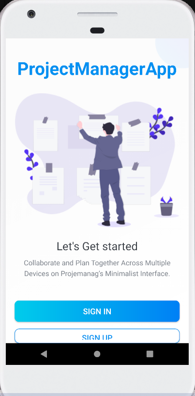
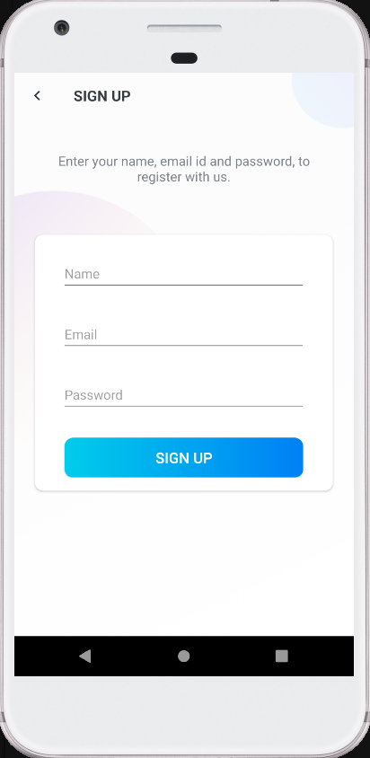
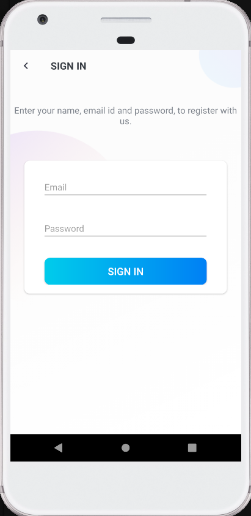
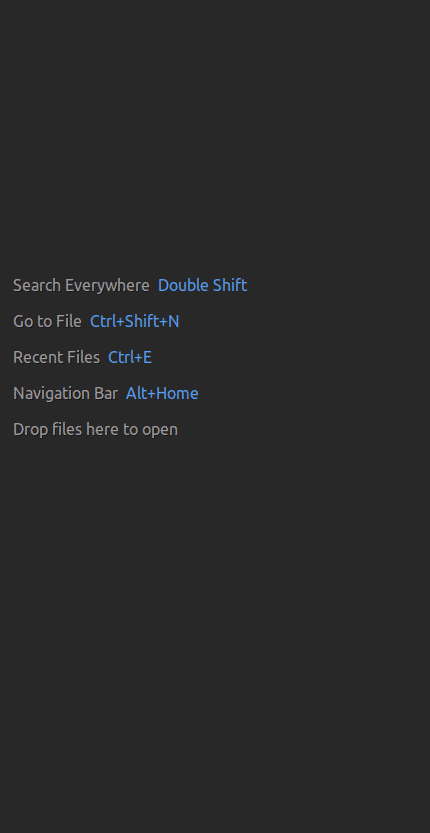

# ProjectManagerApp
App for testing splash screen and log in/sign up screen layout.

<h3>User can:</h3>

- open log in or sign up screen.

<h3>Used technologies:</h3>

- splash screen,
- finding views from layout with view binding,
- full screen mode on app start screen,
- custom SupportActionBar.

<h3>App screenshots:</h3>

Start screen         |  Sign up screen | Sign in screen
:-------------------------:|:-------------------------:|:-------------------------:
  |  |  

<h3>Splash screen:</h3>

